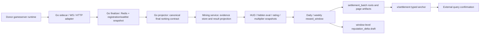

# Poker MTT Phase 3 Production Readiness Spec

**日期**: 2026-04-20
**状态**: Phase 3 closeout spec after multi-agent xhigh review；不是 reward-bearing rollout approval
**范围**: `poker mtt` independent skill-game mining lane
**主线 commit**: closeout baseline on `main` at `7575d32`

相关文档:

- `docs/POKER_MTT_REWARDS_AND_MULTIPLIER_DESIGN.md`
- `docs/POKER_MTT_PHASE2_HARNESS_SPECS.md`
- `docs/LEPOKER_AUTH_MTT_HUD_REFERENCE.md`
- `docs/POKER_MTT_SIDECAR_INTEGRATION.md`
- `docs/HARNESS_API_CONTRACTS.md`
- `docs/superpowers/plans/2026-04-20-poker-mtt-phase3-production-readiness.md`

---

## 1. Executive Decision

Phase 3 的定义不是“打开 poker MTT 主网奖励”，而是把 Phase 2 local beta 里已经跑通的 evidence-to-anchor 链路补成 production readiness gate。

在 Phase 3 所有 P0 gates 通过之前:

- `CLAWCHAIN_POKER_MTT_REWARD_WINDOWS_ENABLED` 继续默认关闭
- `CLAWCHAIN_POKER_MTT_SETTLEMENT_ANCHORING_ENABLED` 继续默认关闭
- `poker_mtt_daily` / `poker_mtt_weekly` 只能作为 staging、internal、provisional 或 simulated reward
- public ELO / public rating 不进入正向 reward weight
- `x/reputation` 不接单场结果、raw HUD、hidden eval 原始分或单场 total score

Phase 3 完成后，系统应当具备低价值 reward-bearing staging rollout 的资格。高价值 mainnet reward 仍需要单独 release review、load evidence 和 ops runbook。

---

## 2. Review Inputs And GitNexus Status

本 spec 综合了 6 个 `gpt-5.4 xhigh` review agents 的结论:

- Product/economics/reward design
- Mining-service data/evidence pipeline
- Go sidecar/finalizer/projector/authadapter
- Chain/settlement/reputation integration
- Security/auth/identity/admin boundaries
- Scale/ops/test harness

GitNexus was used for structural orientation across `clawchain` and `lepoker-auth`.

Important caveat: current MCP `clawchain` index points at `/Users/yanchengren/Documents/Projects/clawchain` and is stale relative to this isolated merged-main worktree. Therefore this document treats local files in the merged `main` worktree as source of truth, and uses GitNexus primarily to confirm existing high-level symbols and donor reference flows. `lepoker-auth` GitNexus is still useful for donor MTT/HUD/MQ architecture references, especially `MttService`, `MttUserService`, `HandHistoryService`, `RecordListener`, `RecordCalculateListener`, and DynamoDB/user-history read models.

---

## 3. Canonical Phase 3 Architecture

Phase 3 keeps the existing product architecture:

Design boundaries:

- Donor runtime remains external. ClawChain copies stable contracts, not the Java monolith.
- Raw hand history remains off-chain and off-ledger; one completed hand is the durable event unit.
- Postgres remains the local beta truth for result/evidence/window state; DynamoDB is a production candidate adapter/read model for raw hand history, not the settlement source of truth.
- Chain integration anchors window roots and immutable artifact hashes, not per-hand or per-game state.
- Reputation is a long-term, window-level derivative after settlement proof, not a direct scoring input.

---

## 4. P0 Acceptance Gates

### G0 - Cross-Doc And Rollout Truth

Acceptance:

- Product docs, reward design, harness contracts, sidecar docs, and implementation plan all say Phase 3 is production readiness, not automatic production launch.
- Feature flags remain default-off.
- GitNexus staleness is recorded when reviews use local source as source of truth.
- `docs/superpowers/plans/2026-04-20-poker-mtt-phase3-production-readiness.md` is the canonical execution plan; the 2026-04-17 file remains a historical review artifact.

### G1 - Final Ranking And Donor Parity

Current blockers:

- Redis-only finalizer can miss registered/waiting/no-show users absent from runtime ranking keys.

Completed on 2026-04-18:

- Go projector JSON now has a golden cross-language fixture validated by Python `ApplyPokerMTTFinalRankingProjectionRequest`.
- The projection contract requires `schema_version`, `projection_id`, `source_mtt_id`, `standing_snapshot_id`, `standing_snapshot_hash`, `final_ranking_root`, and payload `locked_at`.
- Go projector carries donor final-ranking row fields needed by mining-service: snapshot status, standing status, player name, start chip, stand-up status, source rank metadata, zset score, and row create/update timestamps.
- `/admin/poker-mtt/final-rankings/project` uses payload `locked_at`, writes a `poker_mtt_final_ranking_projection` artifact marker, returns the existing projection for same `projection_id` and root, and returns 409 for same `projection_id` with a changed root.
- Go finalizer now accepts a separate registration/waitlist snapshot source, archives registration-only waiting/no-show users as reward-ineligible final-ranking rows, and exposes optional terminal/quiet, entrant count, alive/died/waiting count, and total chip drift barriers.

Additional 2026-04-19 payout-grade blocker:

- Donor-compatible display ranks can tie for same-time/same-start-chip eliminations. Phase 3 reward readiness therefore requires `rank` to be unique and contiguous for `rank_state=ranked` rows, with donor tied placement preserved only as `display_rank` / `source_rank`.

Acceptance:

- Add a cross-language golden fixture where Go emits projection JSON and Python validates it through the FastAPI schema.
- Add `projection_id` or equivalent idempotency key derived from `tournament_id + standing_snapshot_id + policy_bundle_version + final_ranking_root`.
- Same projection root returns the existing projection; changed root for same identity returns conflict.
- Server uses payload `locked_at` after validation, not request-time `now()`.
- Finalizer merges Redis live ranking plus registration/waitlist/no-show source data.
- Registered-but-never-joined and waiting users are archived with reward-ineligible rank states.
- Terminal-state or quiet-period watermark plus count/chip invariants must pass before projection.
- Ranked rows have payout ranks exactly equal to `1..ranked_count`; duplicate/skipped payout ranks reject before API save and before service projection.
- Non-ranked rows (`waiting_no_show`, `unresolved_snapshot`, `duplicate_entry_collapsed`, `voided`) do not carry payout rank.

### G2 - Evidence, MQ, Replay, And Artifact Immutability

Current blockers:

- `/admin/poker-mtt/hands/ingest` is direct ingest, not a production MQ consumer.
- Same hand/version checksum conflicts are returned to caller but not durably persisted as conflict/DLQ/replay-blocking rows.
- Evidence completeness is partly caller-driven via `accepted_degraded_kinds`.
- Hidden eval accepts request-provided `evidence_root` and is not policy/seed/baseline isolated.
- Evidence artifact IDs are stable per tournament/kind and can overwrite old roots.
- Local donor-real MQ testing must include RocketMQ proxy plus a raw hand-history hot store. DynamoDB Local is acceptable for this because AWS supports local DynamoDB-compatible testing; it remains a local/staging adapter target, not the settlement source of truth.

Acceptance:

- Define MQ contract: topic/queue, consumer group, offset, donor `bizId`, message ID, hand identity, version, checksum, source timestamp, replay root.
- Add checkpoint table/model with watermark, lag, last message ID, consumer group, and replay state.
- Add conflict/DLQ table/model for malformed payloads, same-version checksum conflicts, stale lower versions, and crash recovery.
- Reward readiness is policy-owned: required component list, degraded allowlist, policy compatibility matrix, and stale checkpoint block are enforced by service code.
- Missing required hand/HUD/checkpoint/hidden-eval components cannot produce `complete`.
- Hidden eval rows are keyed by policy/evidence/seed/baseline and cannot unlock a projection under a different policy.
- Evidence artifacts become content-addressed or versioned so old roots remain retrievable after rebuilds.
- Local infra must be able to start Redis, RocketMQ namesrv/broker/proxy, and DynamoDB Local. The local table bootstrap must create at least:
  - `poker_mtt_hands`, keyed by `tournament_id + hand_id`, with a room/completed-at read path.
  - `poker_mtt_user_hand_history`, keyed by `player_user_id + completed_at_hand_id`, with a tournament/hand read path.
- Phase 3 harness machines must pre-pull or cache `apache/rocketmq:5.3.2` and `amazon/dynamodb-local:2.5.4` before timed runs. The first cold pull can dominate wall-clock time and must be tracked as environment setup, not tournament runtime. RocketMQ must not be forced to `linux/amd64`; compose should use the native Docker architecture so Apple Silicon runners do not pull a second emulated image. Because the donor sidecar binary runs on the host while RocketMQ proxy runs in Docker, RocketMQ needs two explicit local reachability rules: the broker advertises `brokerIP1=host.docker.internal` with direct `10909/10911/10912` mappings so the proxy can reach the broker, and the proxy enables `useEndpointPortFromRequest=true` so Go v5 route metadata returns the host-mapped gRPC endpoint `127.0.0.1:38081` instead of the container-internal `127.0.0.1:8081`.
- A donor-real MQ harness must prove that `POKER_RECORD_TOPIC` messages can be consumed into the same completed-hand idempotency/checkpoint contract used by mining-service evidence readiness.

2026-04-18 implementation status:

- Mining service now persists MQ checkpoints, conflicts, and DLQ rows with topic, queue, consumer group, offset, donor `bizId`, message ID, hand ID, replay root, lag, and source payload metadata.
- Hand ingest writes checkpoint state for inserted, duplicate, updated, stale, conflict, and DLQ outcomes. A replay after a crash between hand write and checkpoint write repairs the missing checkpoint via duplicate ingest.
- Same hand/version checksum drift is persisted as `manual_review` conflict and blocks evidence readiness.
- Malformed completed-hand payloads are persisted to DLQ and checkpointed as `dlq` instead of crashing the consumer loop.
- Evidence readiness is policy-owned: hand history and consumer checkpoint cannot be caller-degraded; hidden eval and short/long HUD can be policy-degraded but still produce `accepted_degraded`, not `complete`.
- Open conflicts, open DLQ rows, or nonzero checkpoint lag produce `evidence_state=blocked`.
- Evidence artifacts are content-addressed by manifest root so old roots remain retrievable after rebuilds.
- Remaining G2 production hardening: hidden eval still needs a stricter seed/baseline/evidence policy binding before high-value rollout.

### G3 - Auth, Admin, Identity, And Abuse Boundaries

Current blockers:

- Unset `CLAWCHAIN_ENV` defaults to local, so admin auth can fail open in production-like deployments.
- Go principal has `PokerMTTRewardEligible()`, but Python reward projection/window selection has no durable reward-bound identity gate.
- Donor `/token_verify` without miner binding can become `claw1local-*`, valid for harness participation but not production rewards.
- Admin mutation audit fields are self-declared payload, not resolved admin principal.
- Late economic-unit merges can leave duplicate submissions eligible.

Acceptance:

- Non-local/shared runtime startup fails without `CLAWCHAIN_ADMIN_AUTH_ENABLED=1` and non-empty admin token.
- Reward-critical admin POSTs log resolved admin principal and role, not self-attested `operator_id`.
- Final-ranking projector requires bearer auth for non-local targets; 401/403 are non-retryable config/auth failures.
- Add durable reward identity model: `miner_address`, `user_id`, `auth_source`, `economic_unit_id`, `reward_bound_at`, `expires_at`, `revoked_at`, `is_synthetic`, `is_reward_bound`.
- Reward projection and reward-window selection reject `claw1local-*`, donor-only, synthetic, expired, revoked, or unmapped identities.
- Duplicate enforcement uses refreshed server-side economic-unit state and backfills/demotes same-task duplicates when clusters merge late.

2026-04-18 implementation status:

- FastAPI startup now fails closed for non-local runtime without admin auth/token and for external bind without admin auth. Local/test external bind without auth requires an explicit insecure-local override.
- Admin route middleware resolves an audit principal from the bearer token or local harness context; risk override ignores self-attested `operator_id` / `authority_level`.
- Go donor auth marks `/token_verify` responses without miner binding as synthetic `claw1local-*` principals. They can join local harness flows but are not Poker MTT reward eligible without an explicit reward-bound role.
- Miner rows now persist Poker MTT reward identity metadata: user id, auth source, reward-bound flag/time, synthetic flag, expiry, and revocation.
- Final ranking projection and reward-window selection both reject missing, synthetic, not-bound, expired, revoked, or `claw1local-*` identities.
- Remaining G3 production hardening: late economic-unit duplicate demotion/backfill still belongs with the 20k/bulk reward-window wave because it needs the same refreshed bulk miner state path.

### G4 - 20k DB-Backed Reward Window And Budget Contract

Current blockers:

- 2026-04-18 Task 5 已把 20k check 提升到 real service path：`build_poker_mtt_reward_window()` 通过 bulk input snapshot 覆盖 300 / 20k rows、响应体大小、page artifacts 和 root reconstruction。
- Reward-window build 的 per-result final-ranking lookup、per-miner reward identity lookup、per-miner rating snapshot lookup 已移除；Postgres repository 有 bulk/join input path，FakeRepository 有同等 contract。
- Automatic reconcile 已改成 lookback-bounded closed-window candidate query，不再扫描全部历史 poker MTT results。
- Reward pool amount is now tied to an optional production budget ledger when `poker_mtt_budget_enforcement_enabled` is on.
- Window aggregation is versioned. Default `capped_top3_mean_v1` reduces lucky single-result spikes while preserving backward-compatible `max_score_v1` as an explicit policy.
- Multiplier snapshots now record the next UTC daily effective window, so payout/reputation consumers can avoid same-window feedback.

Acceptance:

- Seed 300 and 20k reward-ready rows in Postgres and call the real admin endpoint.
- Main 20k build path uses under 30 SQL statements; unchanged rebuild uses under 5 and no artifact rewrites.
- Response body under 256 KB; 5,000-row page size; exactly 4 page artifacts for 20k rows.
- Root reconstruction validates exactly 20k rows from page artifacts.
- Local/staging RSS delta under 512 MB; p50/p95/p99 latency captured in artifacts.
- Automatic reconcile uses bounded/indexed closed-window query and has EXPLAIN evidence.
- Budget ledger exists with `budget_source_id`, `emission_epoch_id`, lane, reward window, settlement batch, requested/approved/paid/forfeited/rolled amounts, and `budget_root`.
- Daily plus weekly payouts share the same configured emission slice and reject over-budget windows before settlement.
- Budget-ledger accounting is two-stage: build-time reward-window approval records `state=reserved`, `approved_amount`, and `paid_amount=0`; only chain-confirmed anchor completion upgrades the ledger to `state=paid`.
- `reward_window.state=no_positive_weight` remains the canonical empty-positive window state, while the budget side records `budget_disposition.state=forfeited` with `approved_amount=0`.
- Window aggregation policy is explicit and versioned. Default: `capped_top3_mean_v1`.
- Multiplier snapshots have `effective_window_start_at` / `effective_window_end_at` and are treated as later-window inputs.

2026-04-18 Task 5 closeout:

- Added service-path load coverage for 300 and 20k reward-ready rows. The 20k case returns 4 page artifacts at 5,000 rows/page, keeps the response under 256 KB, reconstructs all rows from page artifacts, and guards build-time Python memory with a 512 MB peak threshold.
- Added repository APIs: `load_poker_mtt_reward_window_inputs`, `list_poker_mtt_final_rankings_by_ids`, `list_miners_by_addresses`, `list_latest_poker_mtt_rating_snapshots_for_miners`, `save_artifacts_bulk`, and `list_poker_mtt_closed_reward_window_candidates`.
- Added indexes for reward-window-ready result selection, artifact entity/kind lookup, final-ranking joins, and rating snapshot miner/window reads.
- Unchanged rebuilds compare `input_snapshot_root` and return the existing projection without reward-window update or artifact rewrite.
- Main projection artifacts no longer need to inline 20k `poker_mtt_result_ids`; large responses return root/count/sample for oversized lists and page refs for reward rows.
- Added `scripts/poker_mtt/run_phase3_db_load_check.sh` as the repeatable local/staging entry point for the Phase 3 load contract.

2026-04-18 Task 7 closeout:

- Added `poker_mtt_budget_ledgers` and repository APIs for budget reservations. Enforcement requires `budget_source_id`, `emission_epoch_id`, and a positive epoch budget before payout approval.
- Daily and weekly Poker MTT windows now consume the same emission epoch slice; same reward window rebuilds are excluded from double-counting, while any other approved ledger in the epoch counts against the cap.
- Reward-window projection artifacts now include `aggregation_policy_version`, `budget_disposition`, and `budget_root`. The default aggregation policy is `capped_top3_mean_v1`; `max_score_v1` is only available as an explicit policy.
- `poker_mtt_multiplier_snapshots` now persist `effective_window_start_at` and `effective_window_end_at`, computed as the next UTC daily window after the source result is locked/completed.
- Reward-window build now consumes multiplier snapshots by effective window and folds them into `input_snapshot_root`, so rebuild idempotence no longer ignores multiplier-input drift.
- Added focused economics tests for missing/oversized budgets, shared daily/weekly budget slices, stable grinder versus lucky spike aggregation, and multiplier effective-window timing.

### G5 - Settlement External Query And Bounded Anchor Artifacts

Implemented 2026-04-18 Task 6:

- `x/settlement` now has generated gogo `Query` protobuf types, registered gRPC query server, gateway route, and CLI `settlement-anchor` query for stored anchor state.
- Mining-service chain confirmation refuses tx-only success, compares queried anchor metadata against the expected settlement batch, and persists normalized confirmation statuses on `anchor_jobs`.
- Large settlement anchor payloads no longer inline 20k `miner_reward_rows`; the main anchor artifact stores roots/page refs, and `settlement_anchor_miner_reward_rows_page` artifacts store bounded pages.
- `/admin/settlement-batches` returns bounded summaries by default, so an existing oversized anchor payload cannot re-expand API responses.
- Explicit confirmation states are persisted as `confirmed`, `typed_state_missing`, `fallback_memo_only`, `root_mismatch`, `metadata_mismatch`, `failed`, or `pending`.

Remaining blockers:

- The current first-class tx/query fields cover the core anchor contract; budget roots and reputation/correction lineage are now present in projection and settlement payloads. Full submitter authorization context still needs production controller evidence.
- Production confirmer still needs real local-chain smoke evidence in the final Phase 3 release checklist; unit coverage now proves the gRPC/gateway/CLI query surface and service-side refusal semantics.

Acceptance:

- Generate and wire gRPC query server, gateway, and CLI for `SettlementAnchor`. Done for the lightweight module build with `query.pb.go` plus manual gateway registration.
- Production confirmer waits for tx inclusion, queries stored anchor state, normalizes proto JSON casing, and compares all required fields available in the current anchor contract.
- Confirmation covers batch id, canonical root, anchor payload hash, lane, policy, window start/end, reward roots, page roots, total amount, row count, submitter/authorization context, and correction lineage.
- If fields stay inside `anchor_payload_hash` rather than first-class tx fields, artifact retrieval and hash verification must be part of confirmation.
- Mismatch statuses are explicit: `pending`, `tx_failed`, `typed_state_missing`, `root_mismatch`, `metadata_mismatch`, `fallback_memo_only`, `confirmed`.
- Settlement/admin response surfaces summaries by default and page/artifact refs for large rows. Verified with 20k rows and a response-size guard.
- Fallback memo tx never equals typed anchored state.

### G6 - Reputation Delta, Not Direct Reputation Writes

Current blockers:

- `x/reputation` now has keeper-level `reputation_delta` apply primitives and challenge interface wiring, but it is still not a production-ready external write surface: protobuf/gRPC/CLI tx plumbing, release review, and operator/runbook evidence are still missing.
- Direct single-result reputation writes would over-amplify hidden eval and public rank noise.
- The current Phase 3 output remains dry-run at the Poker MTT service boundary: reward/settlement artifacts root the deltas, but no direct admin/client/single-result path is enabled.

Acceptance:

- Define window-level `reputation_delta_rows_root` only after reward/evidence/settlement gates are stable. Done in reward-window projection artifacts and settlement anchor payloads.
- Reputation delta rows include window id, settlement batch id, policy version, prior score reference, delta reason, cap, score weight, source-result root, and correction lineage.
- Authorized controller append-only apply contract now exists inside `x/reputation` keeper state with controller authorization and delta-id idempotency/conflict checks; external release enablement still needs a separate review.
- No single tournament, raw HUD, public ELO, hidden eval raw score, or client/admin payload writes directly to `x/reputation`.

### G7 - Sidecar Reliability, WS Finish Gate, And Observability

Current blockers:

- Sidecar HTTP orchestration operations now retry transient failures with idempotency keys; betting/action calls remain outside this retry policy.
- WS adapter still needs deeper reconnect/room-migration production soak, but the non-mock finish harness now hard-fails missing ranking/actions/final state.
- 30-player non-mock finish harness is now a hard assertion when `--until-finish` is enabled.
- Observability fields are expanded in the contract; production staging still needs real sink evidence, but local gates now verify the required field list and burst/load artifact shape.
- Historical 2026-04-19 donor-real 30-player auth-mode runs found a real backpressure signal: donor logs `channle is full to write,length:100,cap:100` during final-table/end-ranking bursts. GitNexus/source tracing shows this is `utils.SendToChannelNoWait()` writing to `Hub.Operation`, a fixed-capacity operation/hand-history channel created in `newHub()` and consumed by `ReadMessageFromChannel()`. It is not the player WS action channel. The likely pressure path is `Hub.Write -> h.Operation -> ReadMessageFromChannel -> record/MQ assembly`; slow MQ publish, verbose operation logging, and showdown/all-in bursts can make the producer outrun the single consumer.
- The clean local 30-player gate now requires healthy RocketMQ before accepting a run. The current healthy-MQ rerun has zero Tencent IM external calls, zero RocketMQ publish failures, and zero `Hub.Operation` overflow. The remaining production blocker is the 2,000-table / 20k-user scale gate, where the same counters must be measured under early-stage burst pressure.
- Local donor runs must hard-block Tencent IM side effects. `chat_group_available=false` already disables create/destroy/user-sig paths, but donor `DeleteGroupMember()` does not check that flag in the current reference. Local harness setup applies a reversible safety patch or equivalent mock/block so no `adminapisgp.im.qcloud.com` request leaves the machine.

Acceptance:

- Add retry/backoff policy for idempotent sidecar operations only: start, get-room, join, reentry, cancel. Do not retry betting actions.
- Add tests for 503-then-OK, timeout-then-OK, non-retryable 400/401, and donor error body propagation.
- 30-player explicit join/action-to-finish gate asserts: 30 joined, 30 ranking, 30 users sent actions, at least one `fold`, at least one intentionally timed-out no-send action, legal chip sizes including all-in/max-chip paths, 1 survivor, 29 eliminated/finished, 0 pending, 0 unexpected WS errors after allowed bust/kick close reasons.
- 2,000-table burst test generates completed-hand/finalizer ingest attempts, not just metadata.
- Metrics/log sink receives hand ingest count/conflict, HUD duration, reward-window query duration, selected/omitted counts, artifact page count, MQ lag, DLQ count, and settlement confirmation state.
- Add a donor-operation-channel backpressure gate:
  - Parse donor logs for `channle is full`, `timeout with seconds:5,sendCommand`, and operation channel saturation.
  - Fail the gate if operation-channel overflow occurs in a 30-player local run with RocketMQ healthy.
  - For 2,000-table synthetic burst, record overflow count, per-table operation rate, consumer lag, MQ publish latency, and record assembly duration as release evidence.
  - If overflow persists with healthy MQ, either increase/localize the operation buffer per hand-history burst, split record assembly/MQ publish off the hot operation consumer, or add bounded backpressure plus lossless spillover before reward-bearing rollout.
- Local infra gate must prove Tencent IM blocking by scanning donor logs for absence of `adminapisgp.im.qcloud.com` calls in local/auth harness runs. The same log gate must also fail `POKER_RECORD_TOPIC` / RocketMQ publish failures and `Hub.Operation` overflow during healthy-MQ runs.

2026-04-18 Task 8 closeout:

- Added transient retry/backoff for sidecar envelope calls on timeout, 429, 502, 503, and 504. Unauthorized and other non-retryable donor failures stay single-attempt, preserving donor `msg` in `RequestError`.
- `non_mock_play_harness.py` now validates the production-like finish summary: all users joined, received current MTT ranking, sent actions, one survivor, expected died count, no pending rows, and no unexpected WS errors.
- `generate_hand_history_load.py` now creates one synthetic completed-hand event per early-stage table and reports `completed_hand_event_count` plus `hand_event_checksum_root` for the 2,000-table burst shape.
- `POKER_MTT_OBSERVABILITY_FIELDS` includes reward-window selected/omitted counts, artifact page count, MQ lag, and DLQ count in addition to hand/HUD/query/settlement fields.
- `make test-poker-mtt-phase3-ops` is the local one-command ops gate for sidecar retry, harness/load contract, and Phase 3 DB-backed reward-window scale checks.

2026-04-19 local-real harness update:

- `non_mock_play_harness.py` now includes explicit random `fold` paths, configurable `--timeout-action-rate`, `action_coverage` summary output, and `--require-action-coverage`. The 30-player finish gate can now fail hard unless fold, all-in, legal nonzero chip sizing, and timeout/no-action were all exercised.
- `deploy/docker-compose.poker-mtt-local.yml` now includes DynamoDB Local beside Redis and RocketMQ. `deploy/poker-mtt/rocketmq/broker.conf` advertises `brokerIP1=host.docker.internal` with direct `10909/10911/10912` host mappings so the Docker proxy can reach the broker; `deploy/poker-mtt/rocketmq/rmq-proxy.json` enables `useEndpointPortFromRequest=true` so donor Go v5 producers receive the externally reachable proxy gRPC route `127.0.0.1:38081`. `scripts/poker_mtt/init_local_dynamodb.sh` bootstraps `poker_mtt_hands` and `poker_mtt_user_hand_history` for local hand-history adapter tests.
- Local RocketMQ/DynamoDB images should be pre-pulled before deep-real harness timing. A cold `apache/rocketmq:5.3.2` pull is an environment readiness issue and should be captured separately from game/runtime latency. The local compose file intentionally avoids `platform: linux/amd64` so arm64 hosts use the already-pulled native RocketMQ image. Without proxy `useEndpointPortFromRequest`, RocketMQ QueryRoute returns `127.0.0.1:8081` to the host-run donor, which reproduces `telemeter ... create grpc conn failed`; the local gate must fail that condition before running a deep harness.
- `scripts/poker_mtt/patch_donor_local_safety.py` applies a reversible local donor guard so `DeleteGroupMember()` returns immediately when `chat_group_available=false`, blocking Tencent IM cleanup calls in local harness runs.
- `scripts/poker_mtt/check_local_run_logs.py` is the local ops scanner for Tencent IM external calls, RocketMQ publish failures, and donor operation-channel overflow. `make test-poker-mtt-phase3-heavy` now records its JSON output as release evidence.
- The historical contaminated 30-player real-auth run at `artifacts/poker-mtt/deep-real-auth-20260419T062642Z` finished with `alive=1`, `died=29`, `pending=0`, 173 sent actions, 36 all-ins, and no `autoAction`. It also exposed MQ-unavailable errors and operation-channel backpressure, which are now explicit Phase 3 ops gates rather than ignored log noise.
- The clean 30-player real-auth rerun at `artifacts/poker-mtt/deep-real-auth-20260419T091505Z` is the current local evidence run: 30 joined, 30 received current MTT ranking, 30 sent legal WS actions, `sent_action_total=228`, `finish_mode.finished=true`, `alive=1`, `died=29`, `pending=0`, and `standings_count=30`. `action_coverage` includes `fold=11`, `allIn=36`, `bet=20`, `raise=37`, `call=79`, `check=45`, `timeout_no_action_total=9`, `nonzero_chip_action_count=57`, and `max_nonzero_chip=35410`.
- The same clean rerun captured RocketMQ topic offsets for `ROUND_INFO_TOPIC`, `POKER_RECORD_TOPIC`, `POKER_RECORD_STANDUP_TOPIC`, and `HUB_FINISH_TOPIC`; RocketMQ Go v5 telemetry used the host-reachable proxy route `127.0.0.1:38081`. `local-run-log-check.json` reports zero Tencent IM external calls, zero RocketMQ publish failures, and zero operation-channel overflow. DynamoDB Local bootstrap created `poker_mtt_hands` and `poker_mtt_user_hand_history`.

2026-04-18 Task 10 gate closeout:

- `make test-poker-mtt-phase3-fast` is the fast local gate. It runs Go authadapter/Poker MTT/settlement/reputation packages and all mining-service plus poker_mtt Python contract tests.
- `make test-poker-mtt-phase3-heavy` is the staging/manual gate. It requires `POKER_MTT_PHASE3_POSTGRES_URL` or `CLAWCHAIN_DATABASE_URL`, `POKER_MTT_PHASE3_SETTLEMENT_BATCH_ID`, a running donor sidecar/runtime, and a local-chain node reachable by `POKER_MTT_PHASE3_CLAWCHAIND`.
- Heavy-gate evidence is written under `artifacts/poker-mtt/phase3/` by default:
  - `db-load-20k.log`
  - `non-mock-30-finish-summary.json`
  - `settlement-anchor-query-receipt.json`
- `artifacts/` is intentionally ignored by git; release evidence should be attached to the release review, not committed into the repository.
- `scripts/poker_mtt/release_evidence_pack.py` remains an operator-facing bundler. `phase3_release_pack_built=true` means runtime, settlement replay, burst proof, and emitted-MQ replay were assembled into one pack; `phase3_release_pack_complete=true` additionally requires `same_run_live_mq_projector_complete=true`.

---

## 5. Implementation Waves

Recommended execution order:

1. Final ranking contract and donor parity: cross-language fixture, idempotent projection, registration/waitlist/no-show archive.
2. Admin and reward identity: fail-closed startup, admin principal, durable reward-bound identity, late economic-unit duplicate handling.
3. Evidence and MQ recovery: conflict/DLQ/checkpoint, policy-owned completeness, immutable artifacts, hidden eval policy ownership.
4. 20k DB-backed reward-window gate: bulk APIs, indexes, EXPLAIN, page artifacts, response-size and SQL-count thresholds.
5. Settlement query and anchor proof: generated query path, production confirmer, bounded anchor artifacts, explicit mismatch states.
6. Economics hardening: budget ledger, aggregation policy, multiplier effective-window snapshots.
7. Sidecar and ops gate: retry policy, WS behavior, one-command finish harness, real observability.
8. Reputation delta draft: schema and dry-run artifact only, no direct chain writes until previous gates pass.

---

## 6. Release Rule

Phase 3 passes only when:

- all P0 gates above have tests and runnable commands
- all large-artifact paths are bounded by root/page refs
- local/staging runbooks exist for 30-player sidecar, 300 DB service path, and 20k DB reward window
- settlement proof uses external query, not tx success
- reward selection is identity-bound and policy-bound
- all docs point to this spec as the Phase 3 source of truth

Production/reward-bearing rollout remains disabled until a separate release review explicitly approves:

- budget source id, emission epoch id, and epoch cap
- settlement operator role, chain submitter key custody, and fallback tx policy
- donor sidecar deployment version, admin auth mode, and reward-bound identity authority
- metrics/log sink evidence for required Poker MTT observability fields
- rollback plan for donor runtime, mining-service reward windows, settlement anchoring, and chain submitter
- signed artifact bundle containing the heavy-gate outputs listed above

The operator-facing review bundle is now a runnable contract:

- local canonical closeout: `make materialize-poker-mtt-phase3-release-artifacts`
- command: `make build-poker-mtt-release-review-bundle`
- review doc: [`docs/POKER_MTT_REWARD_ROLLOUT_RELEASE_REVIEW.md`](/Users/yanchengren/Documents/Projects/clawchain/docs/POKER_MTT_REWARD_ROLLOUT_RELEASE_REVIEW.md)
- output: `artifacts/poker-mtt/release-review/release-review-bundle.json`

The canonical local closeout path now materializes:

- `artifacts/poker-mtt/phase3/non-mock-30-finish-summary.json`
- `artifacts/poker-mtt/phase3/local-run-log-check.json`
- `artifacts/poker-mtt/phase3/db-load-20k.log`
- `artifacts/poker-mtt/phase3/settlement-anchor-query-receipt.json`
- `artifacts/poker-mtt/release-review/phase3-release-pack.json`
- `artifacts/poker-mtt/release-review/release-review-bundle.json`
- `artifacts/poker-mtt/release-review/source-paths.json`

`docs/runbooks/poker-mtt-rollout-rollback.md` is now the checked-in rollback reference for the release-review metadata contract.

Only after that should `poker_mtt_daily` / `poker_mtt_weekly` be considered for reward-bearing staging rollout.
